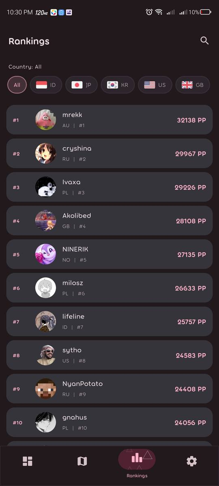
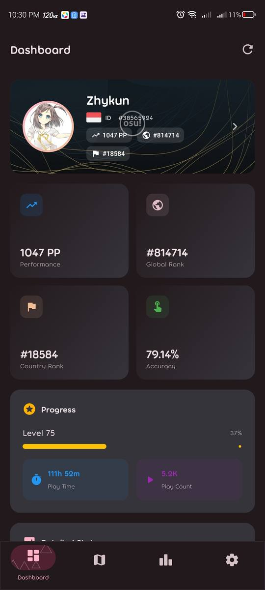
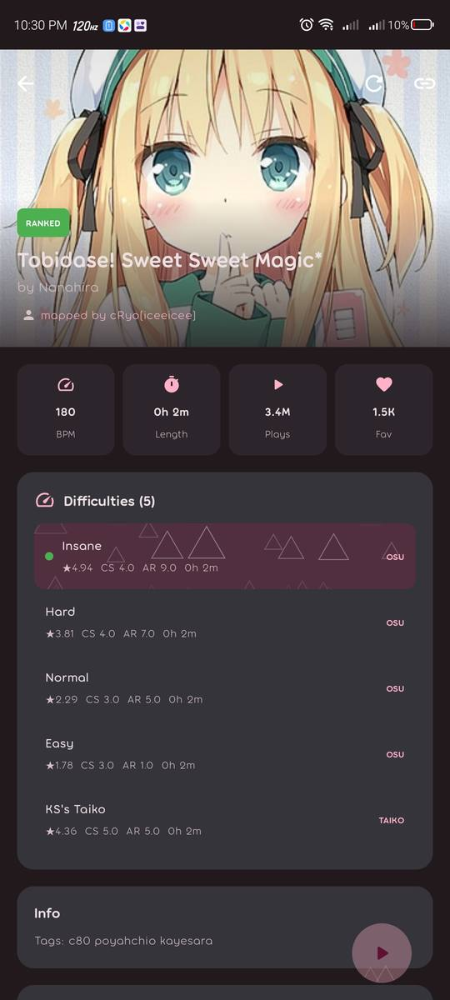
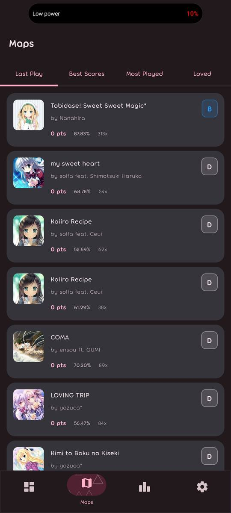
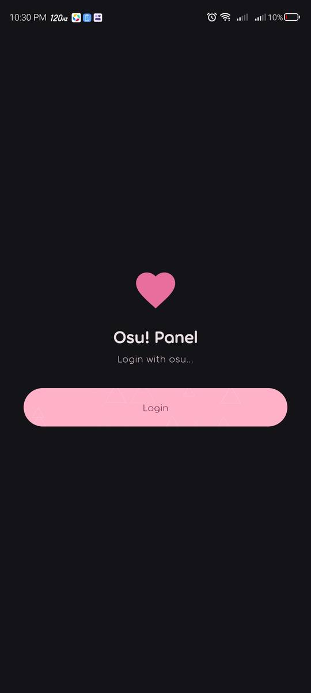
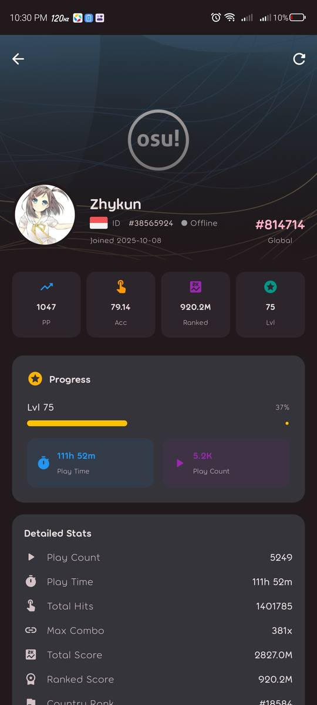
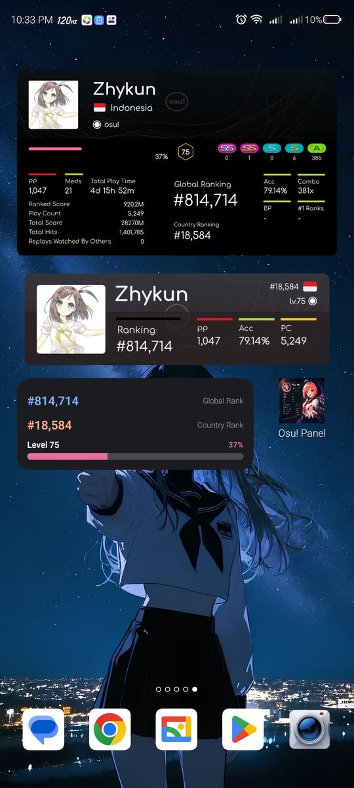
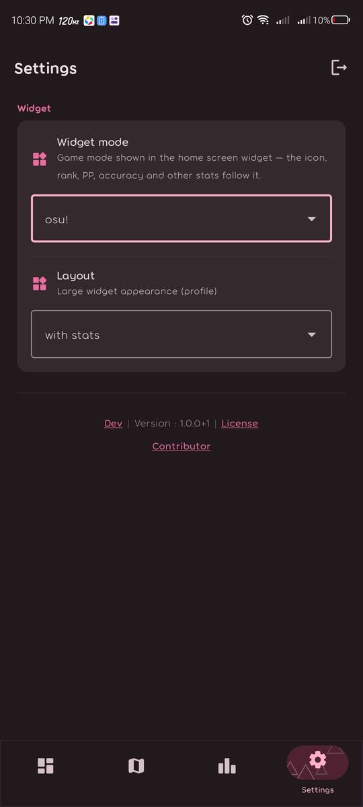

<p align="center">
  
</p>

# Osu! Panel — Native Android

[](https://github.com/Jirankun/Osu-Panel/releases)
[](https://github.com/Jirankun/Osu-Panel/blob/main/LICENSE)
[](https://github.com/Jirankun/Osu-Panel/stargazers)

[](https://kotlinlang.org/)
[](https://developer.android.com/)
[](https://developer.android.com/compose)
[](https://m3.material.io/)
[](https://osu.ppy.sh/docs/index.html)

[](https://deepwiki.com/Jirankun/Osu-Panel)

<!-- ALL-CONTRIBUTORS-BADGE:START - Do not remove or modify this section -->
[](CONTRIBUTORS.md)
<!-- ALL-CONTRIBUTORS-BADGE:END -->

[Repository](https://github.com/Jirankun/Osu-Panel)
·
[Releases](https://github.com/Jirankun/Osu-Panel/releases)
·
[Issues](https://github.com/Jirankun/Osu-Panel/issues)
·
[Screenshoots](https://github.com/Jirankun/Osu-Panel/blob/main/repo/SCREENSHOOT.md)
.
[Contributor](https://github.com/Jirankun/Osu-Panel/blob/main/CONTRIBUTORS.md)

A native Android rewrite of the Osu! Panel app, built
with Jetpack Compose + Material 3.
It includes **OAuth login + the full osu! API v2 layer**, **3 home screen
widgets**, a **card generator**, and most main screens (Dashboard, Maps,
Rankings, Profile, Beatmap Detail, Settings, License, Contributor).

## Screenshots

All previews are collected in [SCREENSHOOT.md](repo/SCREENSHOOT.md) — here
are all of them at a glance:

| | | | |
| --- | --- | --- | --- |
| [](repo/screen/Rrankings.jpg) | [](repo/screen/dashboard.jpg) | [](repo/screen/map_detail.jpg) | [](repo/screen/maps.jpg) |
| [](repo/screen/login.jpg) | [](repo/screen/profile_detail.jpg) | [](repo/screen/launcher_widget.jpg) | [](repo/screen/settings.jpg) |

> **License**: MIT — see [LICENSE](LICENSE).
>
> **Language**: [English](#english) · [Bahasa Indonesia](#bahasa-indonesia)

---

## THIS DOCUMENTATION GENERATED BY AI,THEREFORE, I HOPE YOU CAN UNDERSTAND THE MEANING WRITTEN IN THIS DOCUMENTATION,BECAUSE I WAS IN A HURRY TO UPLOAD IT.
>Dokumentasi ini dibuat oleh AI, olehkarena itu,anda dapat memahami dokumentasi ini,karena saya terburu-buru untuk meng-uploadnya.

<a id="english"></a>

## 🇬🇧 English

### Features

- **OAuth login with osu!** (Authorization Code Grant + PKCE) through a
  Cloudflare Worker that holds the Client Secret — the app never touches it.
- **Quick login** via identifier (ID/username) using Client Credentials, plus
  a **guest mode** (enter the app without an account for browsing).
- **Dashboard** — profile header, stats grid, progress, detailed stats, all
  352 medals (achieved bright / unachieved grey), badges.
- **Maps** — Last Play / Best Scores / Most Played / Loved with pagination.
- **Rankings** — global performance ranking + **partial/fuzzy user search**
  (osu! search endpoint), country filter, laser-triangle UI accents.
- **Profile detail** — full profile, rank history chart, grade counts,
  badges, groups, medals (expandable, per-medal dialog), kudosu, best
  scores, most played, and a **card generator** FAB (Full stats / Skills /
  Mini templates → share the PNG via the Android share sheet).
- **Beatmap detail** — cover, quick stats, difficulties, info, creator,
  leaderboard (with a **YOU** row + **#1** row at the top when applicable),
  audio preview via Media3, **Share** (Android share sheet with QR viewer URL
  + beatmap details), and **QR Beatmap Share** (full-screen QR display → PC
  scans via camera → beatmap card with audio preview plays instantly).
- **Home screen widgets** — Profile Large (stat-sign signature card with
  `with stats` / `with skills` layouts), Rank & Level, and PP.
- **Update check popup** — checks the store via the proxy worker on app open.
  Popup appears **every app open** when an update is cached (user is always
  nudged to update), while the network check runs at most **once per day**.
  Login error shows a **10-second countdown** on the button before retry.
- **License & Contributor screens** — WebView pages with the laser-triangle
  canvas, Torus font injected from `res/font`, and GitHub links opened in an
  external browser.
- **Laser triangles everywhere** — two variants of the osu!lazer `TrianglesV2`
  background: `Modifier.trianglesLine()` (outline/stroke, original style) and
  `Modifier.trianglesFill()` (filled solid + 3D shadow effect, denser layout).
  Used by buttons, cards, screens, and the login button.
- **QR Beatmap Share** — full-screen QR page with share button. Android generates
  a compact QR containing the beatmap URL with base64-encoded JSON (title,
  artist, mapper, BPM, length, cover, URL, tags, audio preview). Share button
  opens Android share sheet with formatted message + QR viewer URL.
  PC opens the viewer → camera scans → beatmap card with audio player appears.
  OG dynamic tags via Cloudflare Worker for social media card previews.

### Architecture

```
┌──────────────┐   OAuth (Custom Tab)  ┌──────────────┐    ┌──────────┐
│  App native  │──────────────────────▶│   osu! web   │    │  osu!    │
│  (Compose)   │◀──────────────────────│   authorize  │    │  API v2  │
└──────────────┘     osupanel://       └──────────────┘    └──────────┘
       │  ▲
       │  │ POST /auth/code, /auth/refresh, /auth/token
       ▼  │
┌──────────────────┐   GET /me, /users, /rankings, ...
│ Cloudflare Worker │───────▶ osu! API v2 (Bearer token)
│ (holds Client    │
│  Secret)          │
└──────────────────┘

┌──────────────┐   QR code (embedded)  ┌──────────────────┐
│  Android App │──────────────────────▶│  PC Browser      │
│  (beatmap)   │  base64 JSON in QR    │  (camera scan →  │
│  Share button│  ?d=<base64> URL      │   beatmap card   │
└──────────────┘                       │   + audio play)  │
     │                                 └──────────────────┘
     │ share sheet                           ▲
     ▼                                       │ OG tags
┌──────────────────┐  Cloudflare Worker  ┌───┴──────────┐
│ Social Media     │────────────────────▶│  QR Viewer   │
│ (Twitter/Discord)│  dynamic OG tags    │  (Worker)    │
└──────────────────┘                     └──────────────┘
```

- The app **never stores the Client Secret** — auth is proxied through the
  Cloudflare Worker (`https://api-osupanel.zhyllanfyllah.my.id`). The worker
  source lives in `worker.js` at the project root. `CLIENT_ID` /
  `CLIENT_SECRET` are configured as Cloudflare environment variables.

- **QR Beatmap Share** uses a Cloudflare Worker (`Web for feature map/worker.js`)
  that serves the viewer page with **dynamic OG meta tags** for social media
  previews. The static fallback (`Web for feature map/index.html`) is deployed
  to Cloudflare Pages. URL format: `?d=<base64>` for share links (OG tags),
  `#<base64>` for QR scan (backward compatible).
- Tokens are stored encrypted in the Android Keystore
  (`EncryptedSharedPreferences`).
- `AuthInterceptor` (OkHttp) injects `Authorization: Bearer`, handles
  401 → refresh via the worker (shared across concurrent requests) → retry
  once. A **definite** refresh failure logs out; a **network** failure keeps
  the token and surfaces a friendly error.
- Home screen widgets read a user snapshot from `WidgetDataStore`
  (a dedicated SharedPreferences), rewritten on every login / app open /
  refresh.

### Login flow

1. "Login with osu!" → AppAuth opens the osu! authorize page in a system
   Custom Tab (`client_id` from `Env.kt`, scopes `identify public friends.read`,
   redirect `osupanel://callback`).
2. The user logs in & approves → redirect back to the app
   (`RedirectUriReceiverActivity`, scheme `osupanel`).
3. The code is exchanged via the worker `POST /auth/code {code, redirect_uri,
   code_verifier}` → access + refresh tokens stored (PKCE is required by
   osu!).
4. The user is fetched via `GET /me`.
5. Any API 401 → automatic refresh via `POST /auth/refresh`.

Besides OAuth login, there is a **quick login** via identifier (ID/username)
using Client Credentials (`POST /auth/token` through the worker).

### Project structure

```
app/src/main/java/net/aokaze/osupanel/
├── OsuPanelApp.kt             # Application — entry point (builds AppContainer)
├── MainActivity.kt            # Activity — entry point (OAuth via Custom Tab)
├── di/AppContainer.kt         # Manual DI: Retrofit, OkHttp, TokenStore, repos, flows
├── core/
│   ├── config/Env.kt          # Worker URL, client id, redirect, scopes, timeouts
│   ├── util/Formatters.kt     # Number/duration/accuracy/date formatting
│   ├── theme/                 # Material 3 + Torus font (colors from colors.xml)
│   └── navigation/            # Routes.kt + OsuPanelNavHost.kt (auth-based NavHost)
├── data/                      # DATA LAYER — UI-free, shared by every feature
│   ├── model/                 # DTOs (kotlinx.serialization)
│   ├── local/                 # TokenStore (encrypted), DataCache, WidgetDataStore
│   ├── medal/                 # MedalService + MedalAssets (all 352 medals)
│   ├── skills/                # SkillsFetcher (osu!skills radar data)
│   ├── remote/                # WorkerApi, OsuApi, AuthInterceptor, ApiError
│   └── repository/            # AuthRepository, ContentRepository
├── feature/                   # PER-FEATURE SCREENS
│   ├── auth/                  # AuthModels, AuthViewModel + ui/ (Splash, Login)
│   ├── home/ui/               # MainShell (bottom nav + pager), DashboardScreen
│   ├── maps/                  # MapsViewModel (4 paged tabs) + ui/MapsScreen
│   ├── rankings/              # RankingsViewModel + ui/RankingsScreen
│   ├── profile/               # ProfileViewModel + ui/ProfileScreen (+ cardgen FAB)
│   ├── cardgen/               # Card generator (ViewModel + UI + share)
│   ├── beatmap/               # BeatmapDetailViewModel + ui/BeatmapDetailScreen + QrCodeScreen
│   ├── settings/ui/           # SettingsScreen, InfoWebViewScreens
│   └── update/                # UpdateChecker + UpdateCheckViewModel
├── widget/                    # HOME SCREEN WIDGETS (3) + SignatureRenderer
└── ui/components/             # Global components (OsuSpinner, TrianglesLine, TrianglesFill, ...)
```

### QR Beatmap Share (Web Viewer)

The PC viewer is served by a **Cloudflare Worker** (`Web for feature map/worker.js`)
that injects **dynamic OG meta tags** for social media card previews, plus a
static fallback on **Cloudflare Pages** (`Web for feature map/index.html`).

**URL formats:**
- `?d=<base64>` — share link (Worker decodes, injects OG tags, serves HTML)
- `#<base64>` — QR scan (client-side decode, backward compatible)

**QR data (compact JSON → base64):**
```json
{"title","artist","mapper","bpm","length","cover","url","tags","preview"}
```

**Share message format:**
```
🎵 Title — Artist
👤 Creator | ★2.15 Hard
🎵 BPM: 190 | ⏱ 3:45
🏷️ tag1, tag2, tag3

https://qr-osupanel.zhyllanfyllah.my.id/?d=<base64>
```

### Build

```bash
./gradlew :app:assembleDebug      # debug APK (installable, no signing needed)
./gradlew :app:assembleRelease    # release APK (R8 + signing from SIGN_* env)
```

Requirements: JDK 17, Android SDK (`local.properties` → `sdk.dir`). Release
signing reads `SIGN_KEY/SIGN_ALIAS/SIGN_KEY_PASS/SIGN_STORE_PASS` from the
environment; without them the release APK still builds but is unsigned.

### Releases (GitHub Actions)

Every build produces **two APKs** from a single `gradlew` run:

- `app-debug.apk` — **never signed**, installable on any device.
- `app-release.apk` — **signed** (when the `SIGN_*` secrets are configured),
  otherwise unsigned. Signing only applies to **nightly** and **release**
  builds — debug is intentionally never signed.

**Release** — created **only from a comment on a pull request**, never
automatically:

| Command | Effect |
| --- | --- |
| `/release` | Build from the PR head, keep the version in `gradle.properties`, create a **draft** GitHub release with both APKs. |
| `/release 1.2.3` | Same, but bump `APP_VERSION_NAME`/`APP_VERSION_CODE` to `1.2.3` first. |

Only the repository **owner / members / collaborators** can trigger it. The
release is a **draft** — review the notes and publish it manually.

**Nightly** — `nightly.yml` runs every day at 00:00 UTC (and manually via
Actions → Nightly → Run workflow). It builds both APKs and **publishes** the
`nightly` GitHub release automatically (recreated on each run).

**CI** — `build.yml` runs on every push to `main` and every pull request and
uploads both APKs as artifacts.

### Signing (keystore + env)

The keystore is **never committed**. The release APK is signed only when all
four `SIGN_*` values are present — locally from your shell env, in CI from
repository secrets:

| Variable | Meaning |
| --- | --- |
| `SIGN_KEY` | Path to the `.jks` keystore file |
| `SIGN_ALIAS` | Alias of the signing key inside the keystore |
| `SIGN_KEY_PASS` | Password of that key |
| `SIGN_STORE_PASS` | Password of the keystore itself |

**Locally** — keep the keystore **outside the repo** (or in `keystore/`, which
is git-ignored) and export the vars in `~/.environment_variable.sh`:

```bash
# ~/.environment_variable.sh (git-ignored)
export SIGN_KEY="$HOME/.keystores/osu-panel-release.jks"
export SIGN_ALIAS="osu-panel"
export SIGN_KEY_PASS="..."
export SIGN_STORE_PASS="..."
```

Create a keystore once with:

```bash
keytool -genkey -v -keystore ~/.keystores/osu-panel-release.jks \
  -alias osu-panel -keyalg RSA -keysize 2048 -validity 10000
```

### Contribution guidelines

> **Project Owner:** in osu > Zhykun , in Github : Zhyllan Fyllah _ Jirankun
>

1. **New feature** → create `feature/<name>/` with `XxxViewModel.kt` +
   `ui/XxxScreen.kt`, then register the route in `core/navigation/`.
2. **New API endpoint** → add a method in `data/remote/OsuApi.kt` (osu! API)
   or `WorkerApi.kt` (worker). DTOs go in `data/model/`.
3. **Shared UI component** → put it in `ui/components/`, one file per
   component. Laser-triangle backgrounds → `Modifier.trianglesLine()` (outline)
   or `Modifier.trianglesFill()` (filled + shadow).
4. **Text** → `res/values/strings.xml`. **Colors** → `res/values/colors.xml`.
5. **Dependencies** → register the instance in `di/AppContainer.kt`
   (manual DI — access via `(application as OsuPanelApp).container`).
6. **New widget** → provider in `widget/`, layout in `res/layout/`, metadata
   in `res/xml/`, receiver in `AndroidManifest.xml`, and add the class to the
   `widgetProviders` list in `WidgetDataStore.kt`.

### Security notes

- `key.txt` (local OAuth keys) is **git-ignored** — never commit it.
- `worker.js` intentionally contains **no** `CLIENT_SECRET` fallback — set it
  as a Cloudflare environment variable (`CLIENT_ID`, `CLIENT_SECRET`).
- The Appteka proxy worker (`Aokaze-Studio-Page-main/worker.js`) has **no**
  generic `?endpoint=` passthrough — the app calls `/app-info?package=...`
  and only `appteka.store/api/1/*` URLs are forwarded, so it cannot be
  abused as an open proxy.

### License

MIT — see [LICENSE](LICENSE). Third-party licenses are listed in
[THIRD_PARTY_LICENSES.txt](THIRD_PARTY_LICENSES.txt) and inside the app
(Settings → License).

---

<a id="bahasa-indonesia"></a>

## 🇮🇩 Bahasa Indonesia

### Fitur

- **Login OAuth dengan osu!** (Authorization Code Grant + PKCE) lewat
  Cloudflare Worker yang menyimpan Client Secret — aplikasi tidak pernah
  menyentuhnya.
- **Quick login** via identifier (ID/username) memakai Client Credentials,
  plus **guest mode** (masuk aplikasi tanpa akun untuk menjelajah).
- **Dashboard** — header profil, grid statistik, progress, statistik detail,
  seluruh 352 medal (yang diraih terang / belum abu-abu), badge.
- **Maps** — Last Play / Best Scores / Most Played / Loved dengan paginasi.
- **Rankings** — ranking performa global + **pencarian user sebagian/mirip**
  (endpoint search osu!), filter negara, aksen UI segitiga lazer.
- **Profile detail** — profil lengkap, grafik rank history, grade counts,
  badge, grup, medal (bisa diperluas, popup per medal), kudosu, best scores,
  most played, plus **FAB generator kartu** (template Full stats / Skills /
  Mini → bagikan PNG lewat share sheet Android).
- **Beatmap detail** — cover, statistik singkat, difficulties, info, creator,
  leaderboard (dengan baris **YOU** dan **#1** di atas saat relevan),
  preview audio via Media3, **Bagikan** (share sheet Android dengan URL QR
  viewer + detail beatmap), dan **QR Beatmap Share** (layar penuh QR → PC
  scan via kamera → card beatmap dengan audio player langsung muncul).
- **Widget home screen** — Profile Large (kartu signature stat-sign dengan
  layout `with stats` / `with skills`), Rank & Level, dan PP.
- **Popup update** — cek toko via proxy worker saat app dibuka.
  Popup muncul **setiap kali app dibuka** jika ada update di-cache
  (user selalu diingatkan update), sementara cek server maksimal **sekali sehari**.
  Login error menampilkan **countdown 10 detik** pada tombol sebelum bisa retry.
- **Layar License & Contributor** — halaman WebView dengan canvas segitiga
  lazer, font Torus di-inject dari `res/font`, link GitHub dibuka di browser
  eksternal.
- **Segitiga lazer di mana-mana** — dua varian latar `TrianglesV2` milik
  osu!lazer: `Modifier.trianglesLine()` (outline/garis, gaya asli) dan
  `Modifier.trianglesFill()` (filled solid + efek bayangan 3D, lebih rapat).
  Dipakai tombol, kartu, layar, dan tombol login.
- **QR Beatmap Share** — layar QR penuh dengan tombol bagikan. Android generate
  QR compact berisi URL dengan JSON base64 (title, artist, mapper, BPM, length,
  cover, URL, tags, audio preview). Tombol bagikan buka share sheet Android
  dengan pesan terformat + URL QR viewer. PC buka viewer → kamera scan →
  card beatmap dengan audio player muncul. OG dynamic tags via Cloudflare Worker
  untuk preview kartu di media sosial.

### Arsitektur

```
┌──────────────┐   OAuth (Custom Tab)  ┌──────────────┐    ┌──────────┐
│  App native  │──────────────────────▶│   osu! web   │    │  osu!    │
│  (Compose)   │◀──────────────────────│   authorize  │    │  API v2  │
└──────────────┘     osupanel://       └──────────────┘    └──────────┘
       │  ▲
       │  │ POST /auth/code, /auth/refresh, /auth/token
       ▼  │
┌──────────────────┐   GET /me, /users, /rankings, ...
│ Cloudflare Worker │───────▶ osu! API v2 (Bearer token)
│ (menyimpan Client│
│  Secret)          │
└──────────────────┘
```

- Aplikasi **tidak pernah menyimpan Client Secret** — autentikasi diproxy
  lewat Cloudflare Worker (`https://api-osupanel.zhyllanfyllah.my.id`).
  Kode worker ada di `worker.js` (root proyek). `CLIENT_ID` / `CLIENT_SECRET`
  dikonfigurasi sebagai environment variable Cloudflare.

- **QR Beatmap Share** memakai Cloudflare Worker (`Web for feature map/worker.js`)
  yang menyajikan halaman viewer dengan **dynamic OG meta tags** untuk preview
  kartu di media sosial. Fallback statis (`Web for feature map/index.html`) di-deploy
  ke Cloudflare Pages. Format URL: `?d=<base64>` untuk share link (OG tags),
  `#<base64>` untuk scan QR (backward compatible).
- Token disimpan terenkripsi di Android Keystore
  (`EncryptedSharedPreferences`).
- `AuthInterceptor` (OkHttp) menyuntik `Authorization: Bearer`, menangani
  401 → refresh via worker (dibagi antar request konkuren) → retry sekali.
  Kegagalan refresh **definitif** = logout; kegagalan **jaringan** = token
  dipertahankan dan muncul error yang ramah.
- Widget home screen membaca snapshot user dari `WidgetDataStore`
  (SharedPreferences khusus), ditulis ulang setiap login / buka app / refresh.

### Alur login

1. "Login with osu!" → AppAuth membuka halaman authorize osu! di Custom Tab
   (`client_id` dari `Env.kt`, scope `identify public friends.read`, redirect
   `osupanel://callback`).
2. User login & menyetujui → redirect balik ke app
   (`RedirectUriReceiverActivity`, scheme `osupanel`).
3. Kode ditukar via worker `POST /auth/code {code, redirect_uri,
   code_verifier}` → access + refresh token disimpan (PKCE wajib di osu!).
4. User diambil via `GET /me`.
5. API 401 apa pun → refresh otomatis via `POST /auth/refresh`.

Selain login OAuth, ada **quick login** via identifier (ID/username) memakai
Client Credentials (`POST /auth/token` lewat worker).

### Struktur proyek

```
app/src/main/java/net/aokaze/osupanel/
├── OsuPanelApp.kt             # Application — titik masuk (membangun AppContainer)
├── MainActivity.kt            # Activity — titik masuk (OAuth via Custom Tab)
├── di/AppContainer.kt         # DI manual: Retrofit, OkHttp, TokenStore, repo, flow
├── core/
│   ├── config/Env.kt          # URL worker, client id, redirect, scope, timeout
│   ├── util/Formatters.kt     # Format angka/durasi/akurasi/tanggal
│   ├── theme/                 # Material 3 + font Torus (warna dari colors.xml)
│   └── navigation/            # Routes.kt + OsuPanelNavHost.kt (NavHost berbasis auth)
├── data/                      # LAPISAN DATA — bebas UI, dipakai semua fitur
│   ├── model/                 # DTO (kotlinx.serialization)
│   ├── local/                 # TokenStore (enkripsi), DataCache, WidgetDataStore
│   ├── medal/                 # MedalService + MedalAssets (352 medal)
│   ├── skills/                # SkillsFetcher (data radar osu!skills)
│   ├── remote/                # WorkerApi, OsuApi, AuthInterceptor, ApiError
│   └── repository/            # AuthRepository, ContentRepository
├── feature/                   # LAYAR PER-FITUR
│   ├── auth/                  # AuthModels, AuthViewModel + ui/ (Splash, Login)
│   ├── home/ui/               # MainShell (bottom nav + pager), DashboardScreen
│   ├── maps/                  # MapsViewModel (4 tab berpaginasi) + ui/MapsScreen
│   ├── rankings/              # RankingsViewModel + ui/RankingsScreen
│   ├── profile/               # ProfileViewModel + ui/ProfileScreen (+ FAB cardgen)
│   ├── cardgen/               # Generator kartu (ViewModel + UI + share)
│   ├── beatmap/               # BeatmapDetailViewModel + ui/BeatmapDetailScreen + QrCodeScreen
│   ├── settings/ui/           # SettingsScreen, InfoWebViewScreens
│   └── update/                # UpdateChecker + UpdateCheckViewModel
├── widget/                    # WIDGET HOME SCREEN (3) + SignatureRenderer
└── ui/components/             # Komponen global (OsuSpinner, TrianglesLine, TrianglesFill, ...)
```

### QR Beatmap Share (Halaman Web Viewer)

Viewer PC dilayani oleh **Cloudflare Worker** (`Web for feature map/worker.js`)
 yang menyuntikkan **dynamic OG meta tags** untuk preview kartu di media sosial,
plus fallback statis di **Cloudflare Pages** (`Web for feature map/index.html`).

**Format URL:**
- `?d=<base64>` — link share (Worker decode, inject OG tags, sajikan HTML)
- `#<base64>` — scan QR (client-side decode, backward compatible)

**Data QR (JSON compact → base64):**
```json
{"title","artist","mapper","bpm","length","cover","url","tags","preview"}
```

**Format pesan share:**
```
🎵 Title — Artist
👤 Creator | ★2.15 Hard
🎵 BPM: 190 | ⏱ 3:45
🏷️ tag1, tag2, tag3

https://qr-osupanel.zhyllanfyllah.my.id/?d=<base64>
```

### Build

```bash
./gradlew :app:assembleDebug      # APK debug (bisa install, tanpa signing)
./gradlew :app:assembleRelease    # APK release (R8 + signing dari env SIGN_*)
```

Syarat: JDK 17, Android SDK (`local.properties` → `sdk.dir`). Signing release
membaca `SIGN_KEY/SIGN_ALIAS/SIGN_KEY_PASS/SIGN_STORE_PASS` dari environment;
tanpa itu APK release tetap ter-build tapi unsigned.

### Rilis (GitHub Actions)

Setiap build menghasilkan **dua APK** dari satu kali `gradlew`:

- `app-debug.apk` — **tidak pernah di-sign**, bisa di-install di perangkat apa pun.
- `app-release.apk` — **di-sign** (jika secret `SIGN_*` dikonfigurasi),
  kalau tidak, tanpa tanda tangan. Signing hanya berlaku untuk build
  **nightly** dan **release** — debug sengaja tidak pernah di-sign.

**Release** — dibuat **hanya dari komentar pada pull request**, tidak pernah
otomatis:

| Perintah | Efek |
| --- | --- |
| `/release` | Build dari head PR, pertahankan versi di `gradle.properties`, buat release GitHub **draft** dengan kedua APK. |
| `/release 1.2.3` | Sama, tapi bump `APP_VERSION_NAME`/`APP_VERSION_CODE` ke `1.2.3` dulu. |

Hanya **owner / member / collaborator** repo yang bisa memicunya. Rilis dibuat
sebagai **draft** — tinjau catatan lalu publish manual.

**Nightly** — `nightly.yml` berjalan setiap hari pukul 00:00 UTC (dan manual
via Actions → Nightly → Run workflow). Ia membangun kedua APK dan
**menerbitkan** release `nightly` secara otomatis (dibuat ulang tiap run).

**CI** — `build.yml` berjalan setiap push ke `main` dan setiap pull request
serta mengunggah kedua APK sebagai artifact.

### Signing (keystore + env)

Keystore **tidak pernah di-commit**. APK release hanya di-sign saat keempat
nilai `SIGN_*` tersedia — lokal dari env shell, di CI dari secret repo:

| Variabel | Arti |
| --- | --- |
| `SIGN_KEY` | Path file keystore `.jks` |
| `SIGN_ALIAS` | Alias kunci signing di dalam keystore |
| `SIGN_KEY_PASS` | Password kunci tersebut |
| `SIGN_STORE_PASS` | Password keystore itu sendiri |

**Lokal** — simpan keystore **di luar repo** (atau di `keystore/`, yang
sudah di-ignore git) dan export variabelnya di `~/.environment_variable.sh`:

```bash
# ~/.environment_variable.sh (di-ignore git)
export SIGN_KEY="$HOME/.keystores/osu-panel-release.jks"
export SIGN_ALIAS="osu-panel"
export SIGN_KEY_PASS="..."
export SIGN_STORE_PASS="..."
```

Buat keystore sekali dengan:

```bash
keytool -genkey -v -keystore ~/.keystores/osu-panel-release.jks \
  -alias osu-panel -keyalg RSA -keysize 2048 -validity 10000
```

### Panduan kontribusi

> **Pemilik Proyek:** di osu > Zhykun , di Github : Zhyllan Fyllah _ Jirankun
>

1. **Fitur baru** → buat `feature/<nama>/` dengan `XxxViewModel.kt` +
   `ui/XxxScreen.kt`, lalu daftarkan route di `core/navigation/`.
2. **Endpoint API baru** → tambah method di `data/remote/OsuApi.kt` (API osu!)
   atau `WorkerApi.kt` (worker). DTO di `data/model/`.
3. **Komponen UI bersama** → taruh di `ui/components/`, satu file per
   komponen. Latar segitiga lazer → `Modifier.trianglesLine()` (outline)
   atau `Modifier.trianglesFill()` (filled + bayangan).
4. **Teks** → `res/values/strings.xml`. **Warna** → `res/values/colors.xml`.
5. **Dependensi** → daftarkan instance di `di/AppContainer.kt`
   (DI manual — akses via `(application as OsuPanelApp).container`).
6. **Widget baru** → provider di `widget/`, layout di `res/layout/`, metadata
   di `res/xml/`, receiver di `AndroidManifest.xml`, dan tambah kelasnya ke
   daftar `widgetProviders` di `WidgetDataStore.kt`.

### Catatan keamanan

- `key.txt` (kunci OAuth lokal) **di-ignore git** — jangan pernah commit.
- `worker.js` sengaja **tidak** berisi fallback `CLIENT_SECRET` — set sebagai
  environment variable Cloudflare (`CLIENT_ID`, `CLIENT_SECRET`).
- Worker proxy Appteka (`Aokaze-Studio-Page-main/worker.js`) **tidak** punya
  passthrough `?endpoint=` generik — app memanggil `/app-info?package=...`
  dan hanya URL `appteka.store/api/1/*` yang diteruskan, jadi tidak bisa
  disalahgunakan sebagai open proxy.

### Lisensi

MIT — lihat [LICENSE](LICENSE). Lisensi pihak ketiga ada di
[THIRD_PARTY_LICENSES.txt](THIRD_PARTY_LICENSES.txt) dan di dalam aplikasi
(Settings → License).
